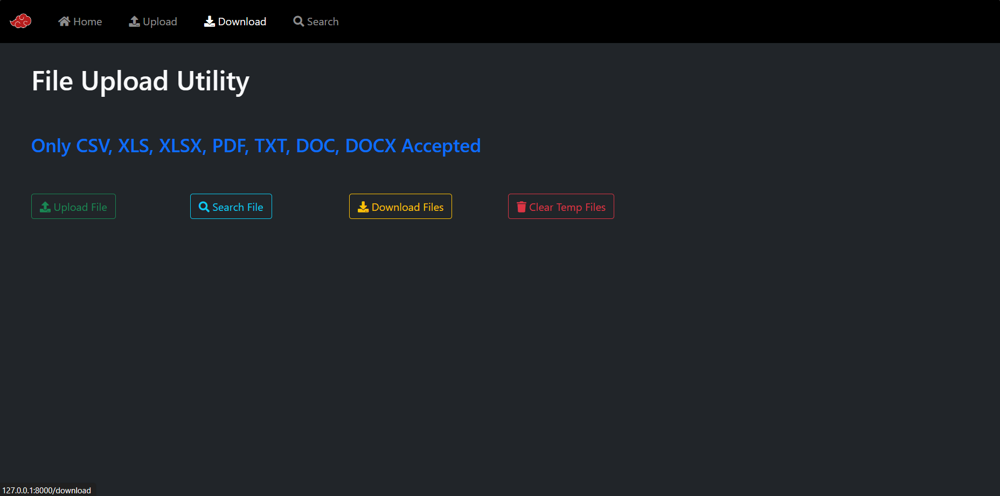
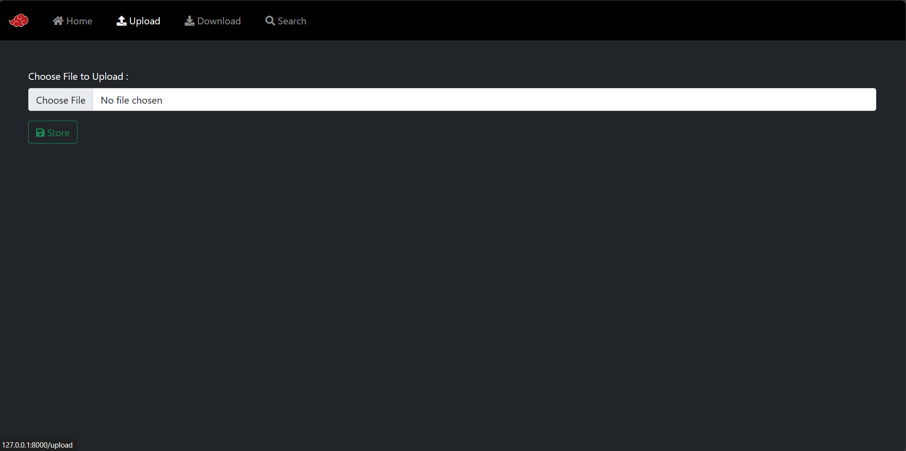
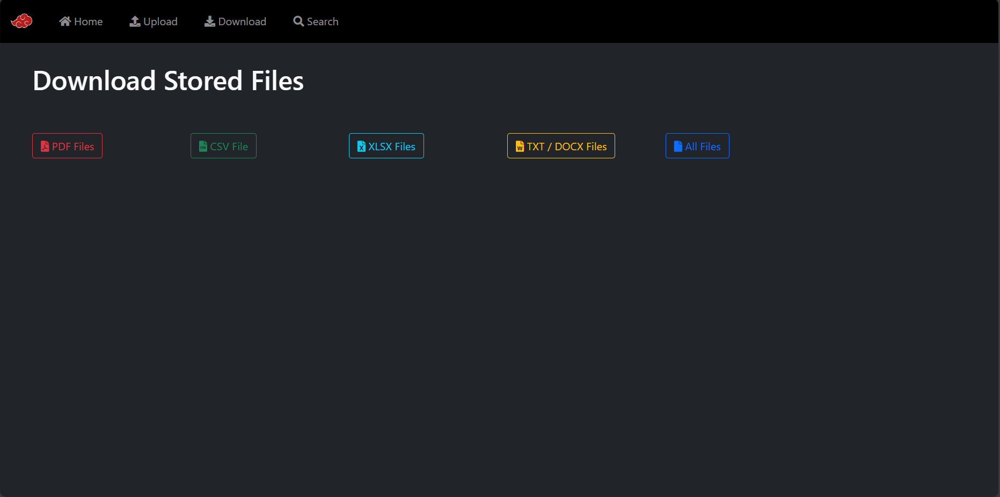
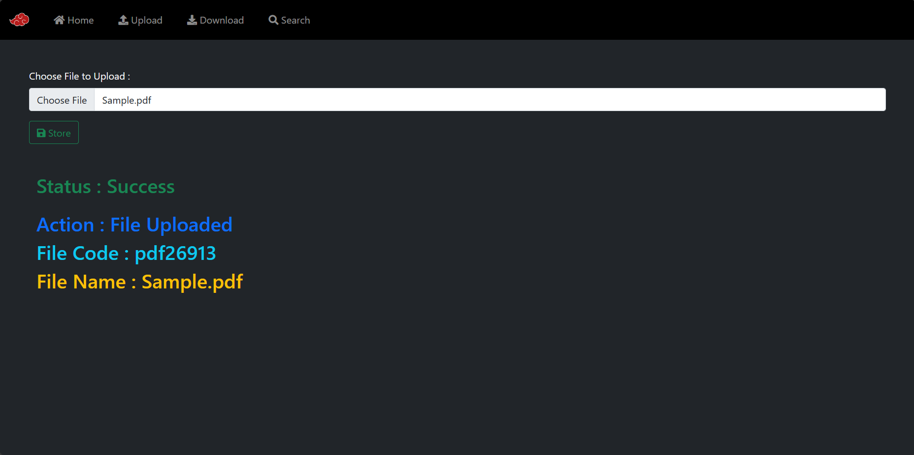
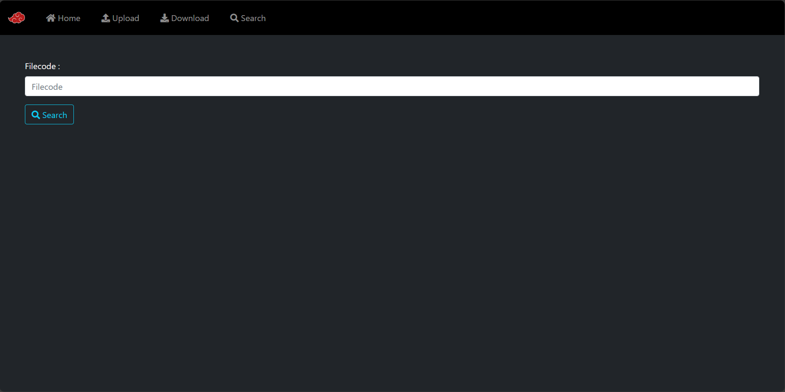
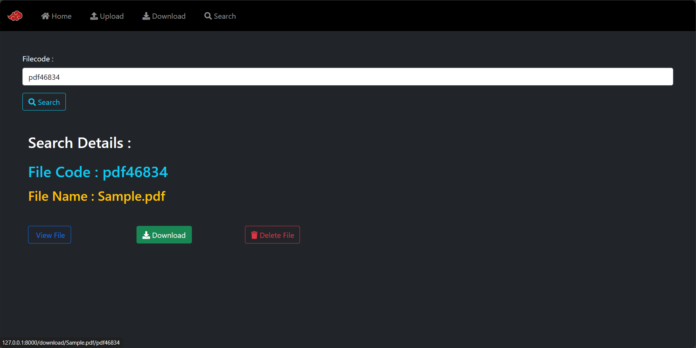
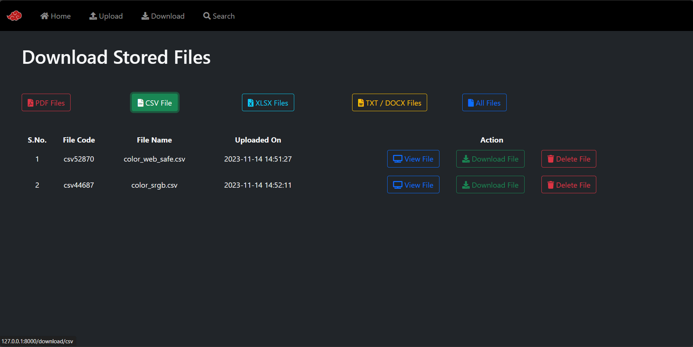
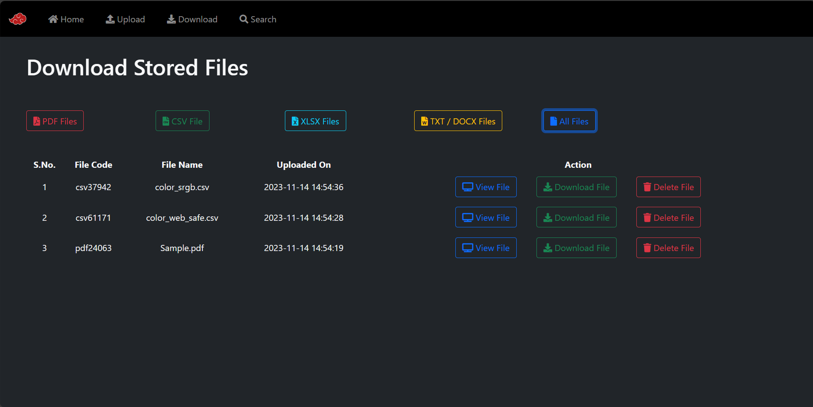
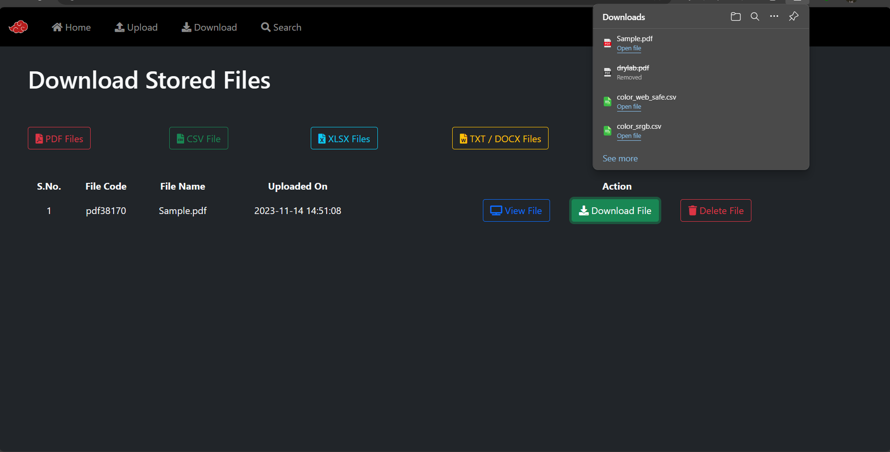
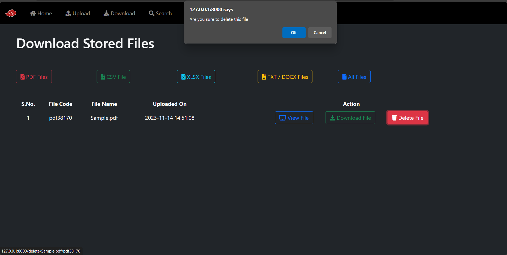

# *File Upload Utility Module*


## Screenshots

**Home**



**Upload**



**Download**



**Upload Files**



**Search**



**Search Files**



**Type Files**



**All Files**



**Download Files**



**View Files(CSV /XLS/ XLSX)**

.png)

**View Files(PDF)**

.png)

**Delete Files**



## Developed Using

**IDE :** Visual Studio Code

**Language :** PHP & Build-in Modules 


## To Run the Project

*Clone the project*

```bash
  git clone https://link-to-project
```

*Go to the project directory*

```bash
  cd FileUploadUtility
  cd FileUploadModule
```
*Open Terminal & Install Dependencies*

```bash
  composer install
```
*Start the server*

```bash
  php artisan serve
```

*Paste in any browser*

```bash
  http://127.0.0.1:8000/
```


## 🔗 Links & Support

[](https://www.linkedin.com/in/santhosh-swamy-v-22ab6b234)

[](https://instagram.com/sd._.sandy?igshid=MzRlODBiNWFlZA==)

[](https://wa.me/+918754120190)
